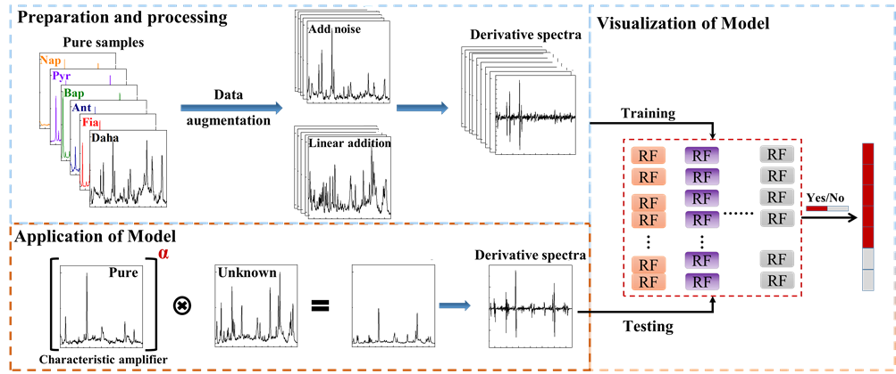

# Vis-CAD

Surface-enhanced Raman spectroscopy (SERS), providing near-single-molecule level fingerprint information, is a powerful tool for trace analysis of target in complicated matrix, especially being facilitated by the development of modern machine learning algorithms. However, both the high demand of mass data and the low interpretability of the mysterious black-box operation significantly limit the well-trained model to real systems in practical application. Aiming these two issues, we constructed a novel machine learning algorithm-based framework (Vis-CAD), integrating visual random forest, characteristic amplifier and data augmentation. The introduction of data augmentation significantly reduced the requirement of mass data, and the visualization of the random forest clearly presented the captured features, by which one was able to determine the reliability of the algorithm. Taking the trace analysis of individual polycyclic aromatic hydrocarbon in mixture as an example, a trustworthy accuracy no less than 99% was realized under the optimized condition. The visualization of algorithm framework distinctly demonstrated that the captured feature was well correlated to the characteristic Raman peaks of each individual. Furthermore, the sensitivity towards trace individual could be improved at least one order of magnitude than that by naked eyes. The proposed algorithm distinguished by the less demand of mass data and the visualization of operation process offers a new way for the indestructible application of machine learning algorithms, which would bring push-to-the-limit sensitivity towards the qualitative and quantitative analysis of trace target, not only in the field of SERS, but also a much wider spectroscopy world.

